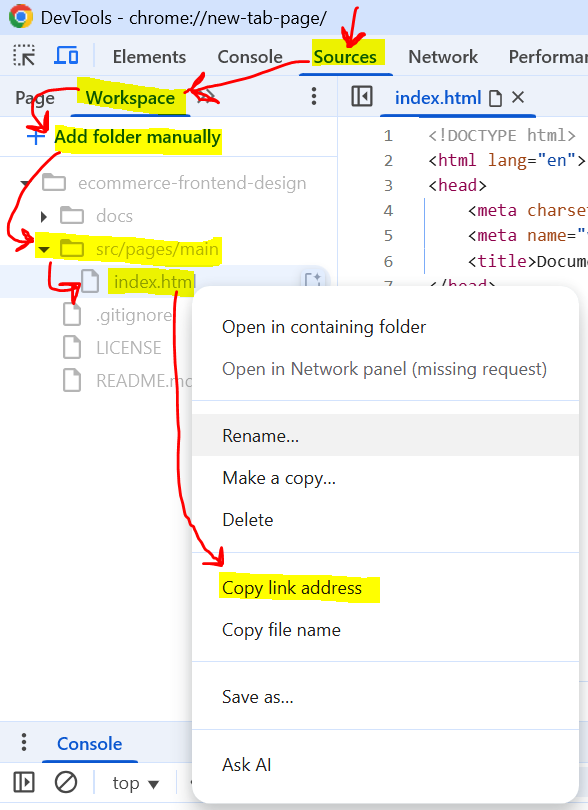
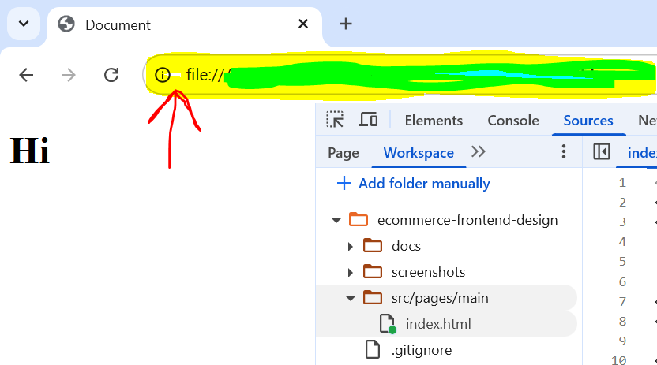

# E-commerce Frontend Design

A comprehensive frontend development project designed for interns at Developers Hub Corporation. This repository contains tasks and exercises to help interns learn modern frontend development practices through building an e-commerce application.

## 📖 About

This project serves as a practical learning environment for frontend development interns. It covers essential concepts and technologies used in modern web development, with a focus on building a complete e-commerce user interface.

## 🎯 Learning Objectives

- Master HTML5 semantic markup and accessibility
- Learn CSS3 advanced features and responsive design
- Understand JavaScript ES6+ fundamentals and DOM manipulation
- Practice version control with Git and GitHub
- Learn deployment and optimization techniques

## 🚀 Getting Started

### Prerequisites

- Basic understanding of HTML, CSS, and JavaScript
- Code editor (VS Code recommended)
- Git installed on your machine

### Installation

1. Clone the repository:
   ```bash
   git clone https://github.com/muzammilmarwat/ecommerce-frontend-design.git
   ```

2. Navigate to the project directory:
   ```bash
   cd ecommerce-frontend-design
   ```

3. To preview the project, you have two options:
    - **Using Chrome DevTools**:  
      - Open developer tools in Chrome (F12 or right-click > Inspect) and go to the "**Sources**" tab.
      - Click "**Workspace**" and "**Add folder manually**" respectively.
      - Choose the cloned repository folder.
      - Open the HTML file under `src/pages/main` directory to view it in the browser.
      - Right-click the HTML file and select "**Copy link address**".
      - 
      - Paste it into the browser's address bar to view the page.
      - 
    - **Using VS Code Live Server Extension**:  
      Install the [Live Server extension](https://marketplace.visualstudio.com/items?itemName=ritwickdey.LiveServer) in VS Code. Right-click any HTML file and select **"Open with Live Server"** to launch a local development server and view your site in the browser.

> [!NOTE]  
> This project uses only static HTML, CSS, and JavaScript—no build step or `npm install` is required.

## 📁 Project Structure

```
ecommerce-frontend-design/
├── docs/                          # Documentation files
│   └── frontend-development-tasks-for-interns.pdf
├── src/                           # Source code
│   ├── assets/                    # Images, fonts, icons
│   └── pages/                     # webpages
│       └── cart/                  # products cart
│       └── main/                  # homepage
│       └── product-details/       # product details page
│       └── products-grid/         # products in gridview
│       └── products-list/         # products in listview
├── .gitignore                     # Git ignore rules
├── LICENSE                        # MIT License
└── README.md                      # Project documentation
```

## 📋 Frontend Development Tasks

### 🗓️ Week 1: Understanding the Design & Building the Layout

#### 🎯 Goal
Familiarize yourself with the Figma design and implement the basic structure of the website using HTML and CSS.

#### 📝 Tasks

- [x] **Analyze the [Figma file](https://www.figma.com/design/8Igr4IzlG1bE1ko7gOyNQP/Ecommerce-Web-Design--Community-?node-id=1-4&p=f&t=6RdW3zaWHBCg37KJ-0)**
- [x] Extract the [desktop layouts](./docs/layouts.md) for all pages.
- [x] **Set up the project structure**
- [x] Create folders for HTML, CSS, and images/assets.
- **Implement the following sections:**  
    - [x] **Header:** Navigation bar with logo, search bar, and menu options.
    - [x] **Footer:** Include all links and styling as per the design.
- **Focus on:**  
    - [x] Accurate spacing, typography, and alignment as shown in the Figma design.

#### 📦 Deliverables

- [x] Fully functional and visually accurate header and footer sections.
- [x] Push your code to the GitHub repository.

## 🛠️ Technologies Used

- **HTML5**: Semantic markup and structure
- **CSS3**: Styling, animations, and responsive design
- **JavaScript**: Interactive functionality and DOM manipulation
- **Git**: Version control system

## 🤝 Contributing

1. Fork the repository
2. Create a feature branch (`git checkout -b feature/task-name`)
3. Commit your changes (`git commit -m 'Add task implementation'`)
4. Push to the branch (`git push origin feature/task-name`)
5. Open a Pull Request

## 📚 Resources

- [Figma Design File](https://www.figma.com/design/8Igr4IzlG1bE1ko7gOyNQP/Ecommerce-Web-Design--Community-?node-id=1-4&p=f&t=6RdW3zaWHBCg37KJ-0)
- [JavaScript.info](https://javascript.info/)
- [Google Web Fundamentals](https://developers.google.com/web/fundamentals)
- [MDN Web Docs](https://developer.mozilla.org/)
- [W3C Web Accessibility Guidelines](https://www.w3.org/WAI/WCAG21/quickref/)
- [CSS-Tricks](https://css-tricks.com/)

## 📄 License

This project is licensed under the MIT License - see the [LICENSE](LICENSE) file for details.

## 👨‍💻 Author

**Syed Muzammil Shah**
- Frontend Development Intern at Developers Hub Corporation

---

**Happy Coding! 🚀**

> Remember: The journey of a thousand miles begins with a single step. Start with the first task and build your way up to becoming a proficient frontend developer!